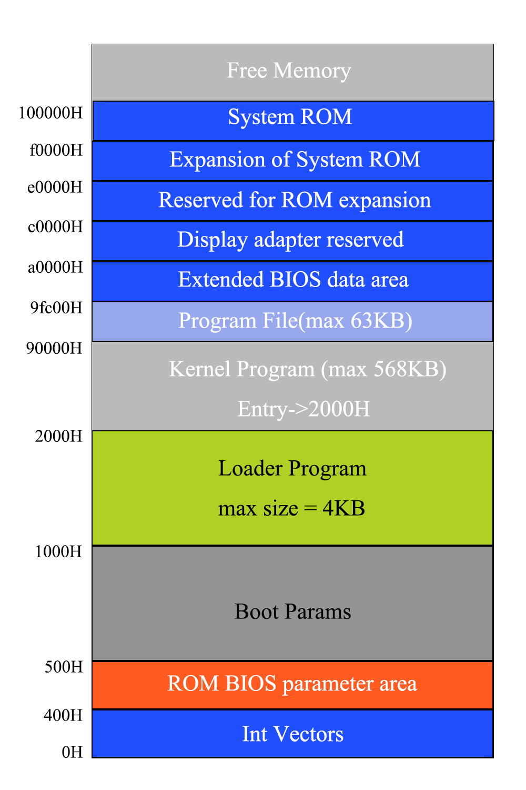

# Chronix

## 介绍




## 快速开始

### 1. 创建目录

新clone下来的项目需要在根目录下创建`target`目录，否则make会报错。

整个项目根目录结构如下:

```
.
├── bootloader
├── Chronix.img
├── include
├── kernel
├── link.ld
├── Makefile
└── target
```


### 2. 构建镜像

```bash
make
```

或

```bash
make image
```


### 3. 构建内核

```bash
make kernel
```


### 4. 镜像制作

使用**挂载、UltraISO**等方式将`target`目录下的`loader.bin`和`kernel.bin`放到`Chronix.img`中。


### 5. 运行系统

```bash
make run
```


