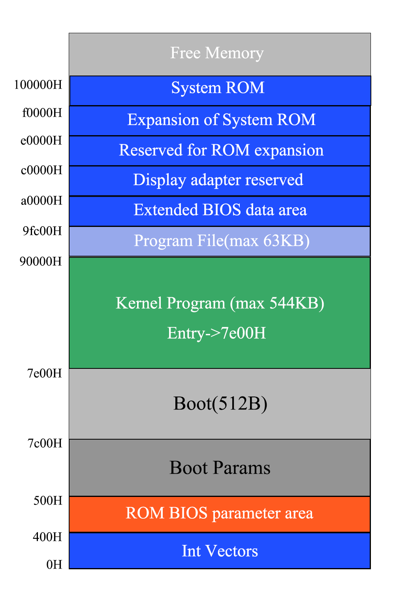

# Chronix

## 介绍




## 快速开始

### 1. 创建目录

新clone下来的项目需要在根目录下创建`target`目录，否则make会报错。

整个项目根目录结构如下:

```
.
├── bootloader
├── doc
├── Chronix.img
├── include
├── kernel
├── link.ld
├── bochsrc
├── Makefile
└── target
```


### 2. 构建镜像

```bash
make
```

或

```bash
make image
```


### 3. 运行系统

使用qemu启动内核

```bash
make run
```

使用qemu调试内核

```bash
make debug
```


使用bochs启动内核

```bash
bochs -q
```


